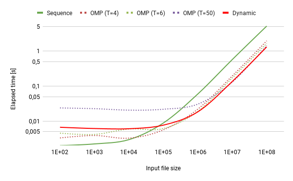

# About the project

This project intends to show difference between accessing and processing data from file using different amount of threads.



## Built With

- C
- OpenMP

# Getting Started

## Prerequisites

Run the following scripts to generate data files:

```sh
python3 ./create-data-bin-files.py
python3 ./create-data-files.py
```

## Usage

After adjusting settings in config.json run:

```sh
python3 ./run.py
```
